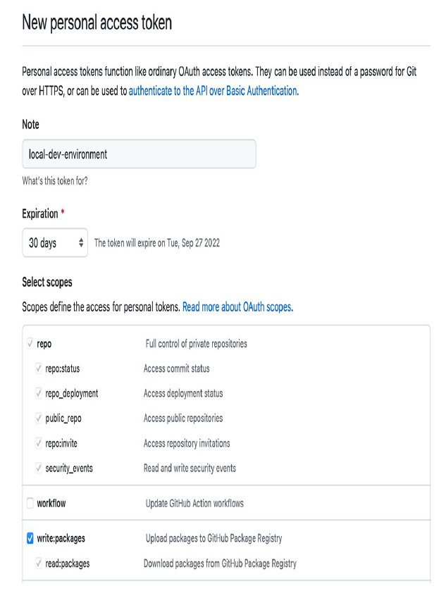

### Project Structure

All the modules in this repository are also repositories (in public scope). Like this-


Publishing images to the GitHub Container Registry requires you to be authenticated, and for that you’ll need a personal access token (PAT).
Go to your GitHub account, navigate to Settings > Developer Settings > Personal access tokens, and choose Generate New Token.


Input a meaningful name, and assign it the ``write:packages`` scope to give the token permissions
to publish images to the container registry. Finally, generate the token and copy its value. 
GitHub will show you the token value only once. Make sure you save it, because you’ll need it soon



Next, open a Terminal window and authenticate with GitHub Container Registry (make sure your Docker Engine is running). 
When asked, insert username (your GitHub username) and password (your GitHub PAT):

```bash
$ docker login ghcr.io
```

By default, GitHub Actions doesn’t allow you to trigger workflows located in other repositories, even if they both belong 
to you or your organization. Therefore, we need to provide the repository-dispatch action with an access token that grants 
it such permissions. The token can be a personal access token (PAT).

Go to your GitHub account, navigate to Settings > Developer Settings > Personal Access Token, and choose Generate New Token. 
Input a meaningful name, and assign it the ``workflow`` scope to give the token permissions to trigger workflows in other repositories.


Finally, generate the token and copy its value.

Next, go to your Catalog Service repository on GitHub, navigate to the Settings tab, and then select Secrets and variables > Actions. 
On that page, choose New Repository Secret, name it DISPATCH_TOKEN and input the value of the PAT you generated earlier. Using
the Secrets feature provided by GitHub, we can provide the PAT securely to the acceptance stage workflow.